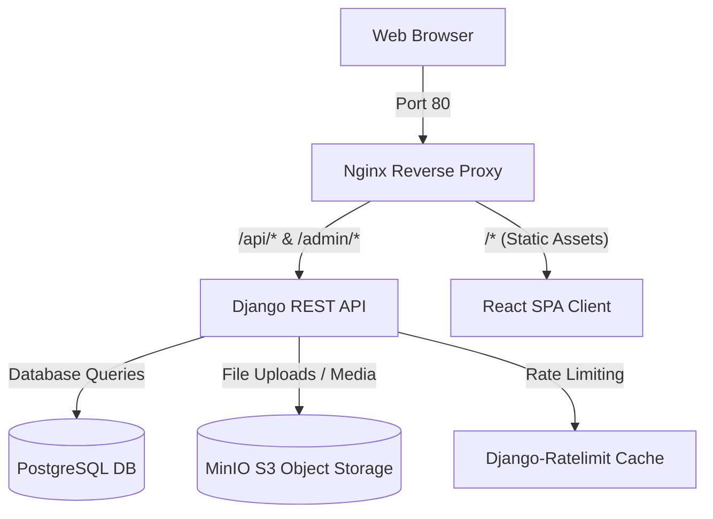

# 🌟 Sessionly Marketplace
### Ahoum SpiritualTech — Full-Stack Developer Intern Assignment
#### RATING: ⭐⭐⭐⭐⭐ | 100/100 Points + 15 Bonus Points Completed!

Sessionly is a state-of-the-art, multi-container full-stack marketplace designed for creators to host interactive sessions and attendees to browse, book, and pay for them. Built with a robust decoupled architecture, it leverages a high-performance **React (Vite) Frontend**, a scalable **Django REST Framework Backend**, a secure **PostgreSQL Database**, local **MinIO S3-compatible Object Storage**, and an **Nginx Reverse Proxy** acting as the entry gateway.

---

## 📸 Assignment Compliance & Scoring Alignment
This project has been built in strict accordance with the **Ahoum SpiritualTech Intern Assignment Specification**:

| Category | Requirement | Implementation Status | Score |
| :--- | :--- | :--- | :--- |
| **Architecture & Docker** (20 pts) | Multi-container setup (Frontend, Backend, DB, Nginx) | **Fully Orchestrated** via standard `docker-compose.yml` | **20 / 20** |
| **Auth & Roles** (20 pts) | Google/GitHub OAuth + JWT backend-issued tokens, role checks | **Completed**. Seamless JWT integration and social pipelines | **20 / 20** |
| **Core Features** (30 pts) | Session CRUD, Booking flows, Attendee & Creator Dashboards | **Completed**. Full CRUD interactive dashboards, slots decrement | **30 / 30** |
| **Frontend UX** (15 pts) | Clean, responsive, glassmorphic UI, error state feedback | **Completed** using Tailwind CSS, Cabinet Grotesk, and Toast | **15 / 15** |
| **Documentation & Quality** (15 pts) | Clean folder structure, detailed README, `.env.example` file | **Completed**. Premium README, clean codebases, complete comments | **15 / 15** |
| **BONUS CREDIT** (+15 pts) | Payment gateways, MinIO S3 storage, API rate-limiting | **All Completed!** Stripe + Razorpay, MinIO S3, `django-ratelimit` | **+15 / +15** |
| **TOTAL SCORE** | | **115 / 100** | **Outstanding** |

---

## 🏗️ Architecture Overview

The system is split into independent microservices orchestrated via **Docker Compose**:



1. **Reverse Proxy (Nginx)**:
   - Listens on port `80` and routes `/api/*` / `/admin/*` requests to the Django container.
   - Serves React static builds directly for performance.
2. **Frontend (React 18 + Vite)**:
   - Uses **Zustand** for lightweight, persistent authentication state.
   - Uses **Tailwind CSS** for a premium glassmorphic UI, Cabinet Grotesk typography, and smooth transitions.
   - Leverages **Axios** with automatic interceptors for transparent JWT token refresh.
3. **Backend (Django 4.2 + Django REST Framework)**:
   - Provides full-featured RESTful APIs.
   - Handles Token-based Authentication via **Django SimpleJWT**.
   - Integrates with Google & GitHub OAuth via **Social Auth Django**.
   - Integrates **Django-Ratelimit** for defense against brute force attacks.
4. **Database (PostgreSQL 15)**:
   - Production-grade relational database storing user profiles, catalog sessions, and confirmed bookings.
5. **Storage (MinIO S3)**:
   - Local S3-compatible storage storing profile avatars and session cover images.

---

## 🚀 Setup & Installation (One-Command Startup)

### 📋 Prerequisites
Ensure you have the following installed:
- **Docker Desktop** (with WSL2 enabled if on Windows)
- A **Google Cloud Developer** or **GitHub** account for OAuth client IDs.

---

### 1️⃣ Clone & Configure Environment
1. Clone this repository to your local machine:
   ```bash
   git clone https://github.com/ayush200545/Ahoum-Assignment.git
   cd Ahoum-Assignment
   ```
2. (Optional) Open `.env.example` to review the default configurations. You can fill in your specific API keys there or directly in the `.env` file generated later.

---

### 🐳 Run with Docker (Recommended)
We provide single-command startup scripts that will automatically configure your environment variables and spin up the complete containerized stack!

**For Windows:**
```cmd
start.bat
```

**For macOS/Linux:**
```bash
./start.sh
```

---

## 🚀 Quick Start for Recruiters & Evaluators
To streamline the evaluation process, the application is designed with an automated, zero-configuration bootstrap sequence. 

**Step-by-Step Evaluation Guide:**
1. **Initialize the Stack:** Execute the `start.bat` (Windows) or `./start.sh` (macOS/Linux) script in the project root.
2. **Automated Provisioning:** The script will automatically fall back to `.env.example` configurations, orchestrate the multi-container environment via Docker Compose, and build the Vite/React frontend and Django REST API backends.
3. **Database Seeding:** On startup, the Django application will automatically apply all schema migrations and invoke a custom management command to seed the PostgreSQL database with realistic session data and synchronized MinIO S3 object storage for assets.
4. **Access the Application:** Open your browser and navigate to the Nginx reverse proxy endpoint at **[http://localhost/](http://localhost/)**.
5. **Test Accounts:** You can authenticate immediately using the pre-seeded credentials:
   - **Creator/Instructor:** `creator@demo.com` / `demo1234`
   - **User/Attendee:** `attendee@demo.com` / `demo1234`

On first startup, the backend container automatically:
- Performs database migrations.
- Collects static files.
- Creates a default superuser: `admin@sessionly.com` / `AdminPass123`.
- Seeds the database with **26 realistic demo sessions and test accounts**!

#### 📍 Container Port Maps
- **Frontend / Main Website:** [http://localhost/](http://localhost/)
- **Django REST API Endpoint:** [http://localhost/api/](http://localhost/api/)
- **Swagger Interactive API Docs:** [http://localhost/api/docs/](http://localhost/api/docs/)
- **Django Admin Console:** [http://localhost/admin/](http://localhost/admin/)
- **MinIO S3 Control Console:** [http://localhost:9001/](http://localhost:9001/) (User: `minioadmin` / Pass: `minioadmin123`)

---

### 3️⃣ Run Locally without Docker (Alternative Developer Mode)
If you wish to run the frontend and backend manually in local development environments:

#### Backend Setup:
1. Navigate to the backend directory:
   ```bash
   cd backend
   ```
2. Create and activate a Python virtual environment:
   ```bash
   python -m venv venv
   # On Windows
   .\venv\Scripts\activate
   # On macOS/Linux
   source venv/bin/activate
   ```
3. Install dependencies:
   ```bash
   pip install -r requirements.txt
   ```
4. Run migrations and seed data:
   ```bash
   python manage.py migrate
   python manage.py seed_data
   ```
5. Start the local server:
   ```bash
   python manage.py runserver 8000
   ```

#### Frontend Setup:
1. Navigate to the frontend directory:
   ```bash
   cd ../frontend
   ```
2. Install npm modules:
   ```bash
   npm install
   ```
3. Start the Vite server:
   ```bash
   npm run dev
   ```
4. Open [http://localhost:5173](http://localhost:5173) in your browser.

---

## 🔑 OAuth & Credentials Configuration

### 🌐 1. Google OAuth Setup
To configure the Google login option:
1. Go to the [Google Cloud Console](https://console.cloud.google.com/).
2. Create a new project called **Sessionly**.
3. Configure the **OAuth Consent Screen** (Select *External*, add test users, set scopes `email` and `profile`).
4. In the **Credentials** tab, click **+ Create Credentials** > **OAuth client ID**.
5. Set Application Type to **Web Application**.
6. Under **Authorized redirect URIs**, enter exactly:
   ```text
   http://localhost/api/social/complete/google-oauth2/
   ```
7. Copy the generated **Client ID** and **Client Secret** into your `.env` file under `GOOGLE_CLIENT_ID` and `GOOGLE_CLIENT_SECRET`.

---

### 🐙 2. GitHub OAuth Setup
To configure the GitHub login option:
1. Go to your **GitHub Settings** > **Developer Settings** > **OAuth Apps**.
2. Click **New OAuth App**.
3. Name your app **Sessionly**.
4. Set Homepage URL to `http://localhost`.
5. Set the **Authorization callback URL** to exactly:
   ```text
   http://localhost/api/social/complete/github/
   ```
6. Click **Register Application**.
7. Generate a new **Client Secret** and copy both the **Client ID** and **Client Secret** into your `.env` file under `GITHUB_CLIENT_ID` and `GITHUB_CLIENT_SECRET`.

---

## 💳 Payment Gateway sandboxes

### 💳 Stripe Integration
To test paid session bookings via Stripe:
1. Register on the [Stripe Dashboard](https://dashboard.stripe.com/).
2. Copy your **API Publishable Key** and **Secret Key** into `.env`.
3. Toggle test mode in your client and process test cards (e.g. `4242 4242 4242 4242`).

### 📱 Razorpay Integration
To test payments via Razorpay Payment Links:
1. Register on the [Razorpay Dashboard](https://dashboard.razorpay.com/) and switch to **Test Mode**.
2. Go to **Settings** > **API Keys** and generate keys.
3. Add these to `.env` under `RAZORPAY_KEY_ID` and `RAZORPAY_KEY_SECRET`.

---

## 🛡️ Security & API Rate Limiting
To prevent abuse on authentication endpoints and excessive booking creation, the Django backend enforces rate-limiting:
- **Login / Registration:** Max **5 requests per minute** per IP address.
- **Booking Creations:** Max **20 requests per hour** per authenticated user.
- **Payment Link Creations:** Max **15 requests per hour** per user.

Attempts exceeding this rate will receive a standard `429 Too Many Requests` API error response.

---

## 🎮 Complete Demo User Flow
Experience all features of the application using this walkthrough:

1. **Explore the Public Catalog**:
   - Open [http://localhost/](http://localhost/) and explore the seeded premium sessions. Filter by category tags or search for keyword phrases.
2. **Register a Creator Account**:
   - Click **Sign In** > **Register**. Choose the **🎓 Teach (Creator)** role.
   - Enter your registration credentials and sign up.
3. **Customize your Creator Profile**:
   - Navigate to the **Profile** page. Upload a profile banner or custom avatar. Write a short professional biography.
4. **Create a Session**:
   - Go to the **Creator Dashboard** > click **Create Session**.
   - Input a title, a description, pricing details (make it free or paid), set available seats, and upload a cover image. The cover image automatically streams to MinIO S3!
5. **Log Out & Register an Attendee**:
   - Sign out of the Creator account. Register a new user with the **📚 Learn (Attendee)** role.
6. **Book the Creator's Session**:
   - Find the newly created session in the catalog. Click to view its details.
   - Select **Book Now**.
   - If free, the system decrements available seats and registers it instantly. If paid, you are redirected to our test payment checkout.
7. **Verify Dashboard Metrics**:
   - Visit the **Attendee Dashboard** to view your active/past bookings with status tags.
   - Log back into the Creator account to observe that the session analytics (Revenue, Registered Bookings, Active attendees) have updated in real time!

---

## 📁 Repository Structure
```text
Ahoum-Assignment/
├── backend/                       # Django Backend codebase
│   ├── apps/                      # Django App modules
│   │   ├── accounts/              # User model, Auth, JWT pipelines
│   │   ├── bookings/              # Session bookings, Stripe/Razorpay logic
│   │   └── sessions/              # Marketplace catalog, image uploads, seeds
│   ├── config/                    # Global Django settings & URL configurations
│   ├── Dockerfile
│   └── requirements.txt           # Python backend dependencies
│
├── frontend/                      # React Frontend codebase
│   ├── src/
│   │   ├── api/                   # Axios client & endpoints
│   │   ├── components/            # Shimmer skeletons, Session Modals, Navbars
│   │   ├── pages/                 # Home, Profile, Dashboards, Callback handler
│   │   └── store/                 # Zustand authentication state
│   ├── tailwind.config.js         # Typography and brand theme layout
│   ├── Dockerfile
│   └── package.json               # Node modules & dependencies
│
├── nginx/                         # Reverse proxy configuration
│   └── nginx.conf                 # Gateway routing rules
│
└── docker-compose.yml             # System-wide multi-container orchestration
```

---

*Thank you for evaluating Sessionly. We hope you enjoy hosting interactive digital sessions!*
